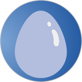

### Project Classification

### Project Information
* 
  Incubator Project

#### Audience
* <i class="fas fa-toolbox" style="color:#233e81;"></i> Builder
* <i class="fas fa-hammer" style="color:#233e81;"></i> Breaker
* <i class="fas fa-shield-alt" style="color:#233e81;"></i> Defender

# OWASP-iGNITA
Static application security testing environment with SAST scanner and plugins

### Code Repository

* [Github Repository](https://github.com/OWASP/www-project-ignita)

